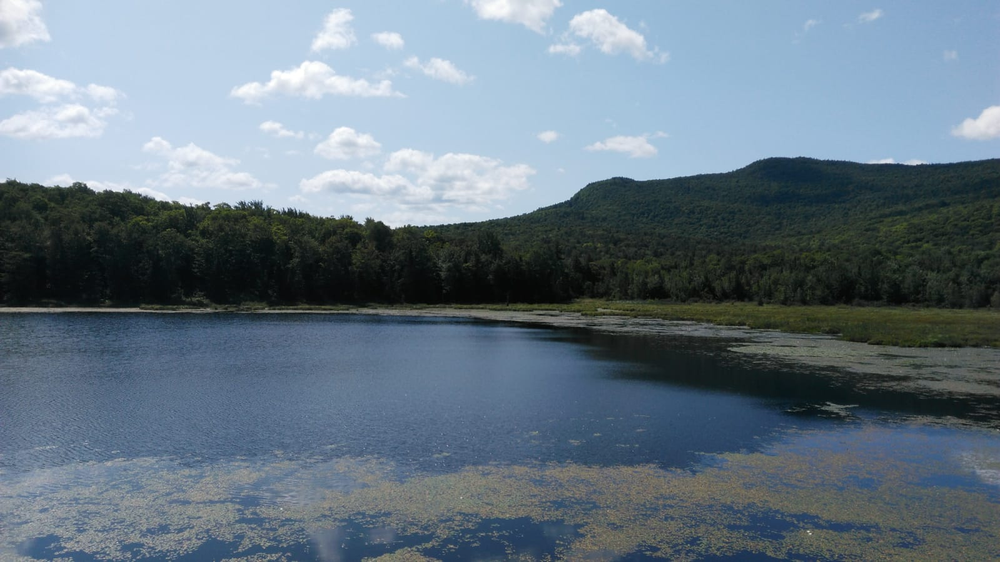

*View from a hike in Mont Orford.*  

I'm a master's in biostatistics graduate with a passion for using data and statistics to answer questions. My main interest lies in healthcare research and how we can improve existing systems for better population health. I also have a bachelor's in biology and mathematics where I got interested in statistical genetics and bioinformatics. 

This website was built to share some of my side projects and keep my data skills up-to-date. I enjoy applying my data analysis skills to a wide range of problems and hope to show that on this site. 